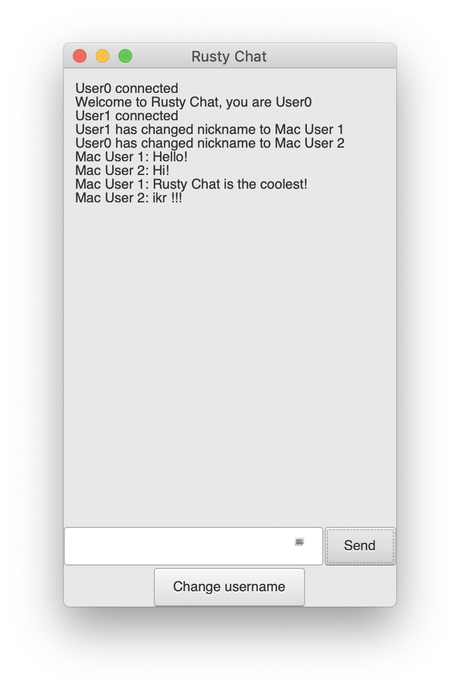
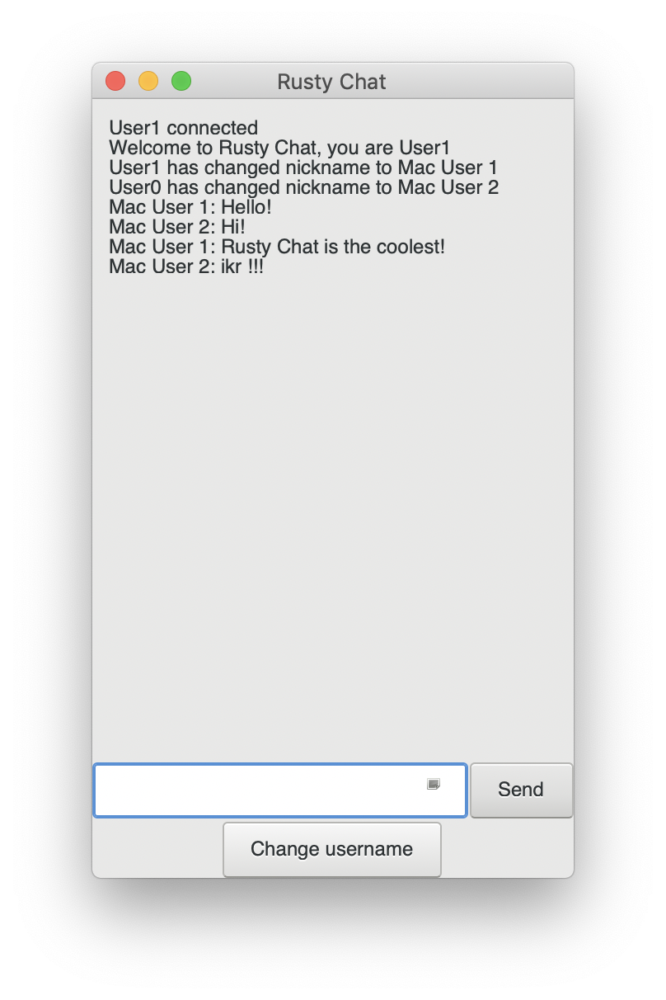

# Rusty Chat
Rusty Chat is a chat server written entirely in Rust that allows various users to communicate via a chat server.

 

## Overview

### Dependencies
- [GTK+](https://gtk-rs.org/docs-src/requirements)
- [Rust](https://www.rust-lang.org/en-US/install.html)

### Instructions
- To see the options for the server, do:
  ```
  cd server
  cargo build
  ./target/debug/chat-server --help
  ```
  Mainly, running the executable with `-r` runs the server through the host IP, so that different machines can connect to   it. The default ip is `localhost`
- To see the options for the client, do:
  ```
  cd client
  cargo build
  ./target/debug/chat-client --help
  ```
  Running the executable alone connects to the client to `localhost`, otherwise an IP address can be specified as an argument

### Code Architecture
* Server
   * Take advantage of Rust’s concurrency
   * Receive/relay messages to the channel
   * Keep track of connected users
* Client
   * Terminal chat window (GUI)
   * Let user send messages and change nickname
   
### Contributors (aka the jaded rustaceans)
- Emma "Crusty" Suarez 
- Megan Paik
- Yash Palkhiwala
